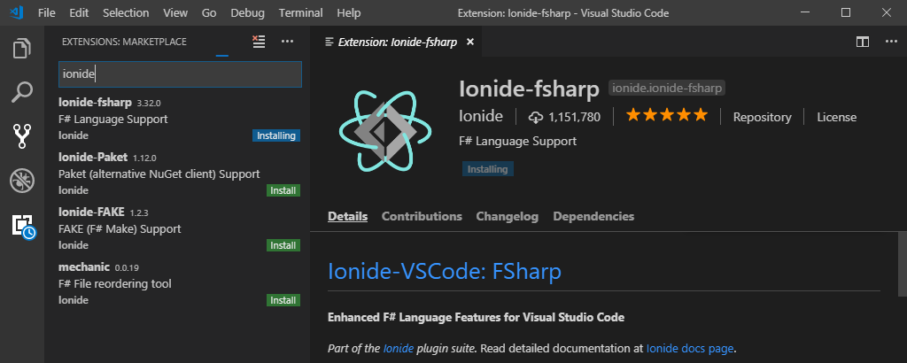
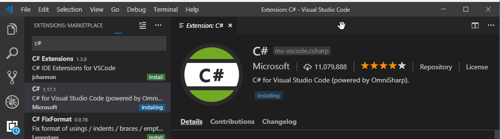
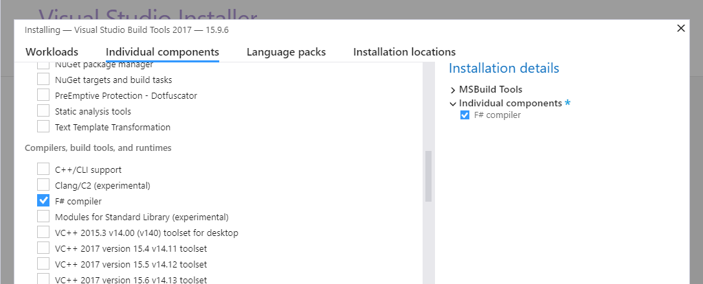
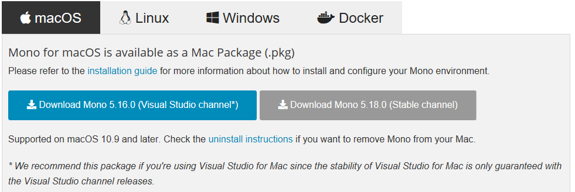
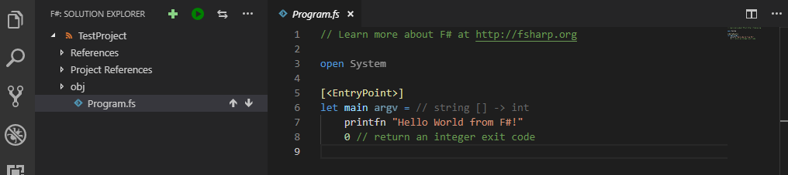

+++
title="F# and Fable Installfest 2019"
date=2019-02-21
[taxonomies]
tags=["F#", "Fable", "dotnet", "netcore"]
+++

Starting from scratch lets set up a development environment for F#.  Following this will get you completely set up for command line tools, servers and web UI development.  I will not be covering desktop or mobile development but you should know that F# also excels in those domains.

I will go through setting up Visual Studio Code because that's what I use.  If you are  [Visual Studio](https://visualstudio.microsoft.com/) and [Jetbrains Rider](https://www.jetbrains.com/rider/) are also excellent choices.

<!-- more -->

# MacOS?
If you're on MacOS {{icon(name="fas fa-apple-alt")}} (or Linux {{icon(name="fab fa-linux")}}) the steps will be very similar. I will try to point out where you need to do something different if you're not using Windows but there may be errors since I don't have a mac to test it on.  If you follow the instructions on a mac and they don't work please email or tweet me and let me know.

# Install F# with .NET Core

## Step 1 - Install .NET Core SDK
The first thing you need to do is install the .NET Core SDK.  This gives you a set of command line tools for creating projects managing dependencies and building.

Go to [http://dot.net](http://dot.net) and click download then choose "Download .NET Core SDK".  It should automatically select the right version for the OS you're running.  When you install it should automatically add the `dotnet` command to your path.  

If you already have a version of .NET Core installed this will update to the latest and add it to your path.  It will leave the old version available in case something still needs it.

[](http://dot.net)

If you're feeling impatient you can go ahead and start on step 2 while the download finishes.

## Step 2 - Install Visual Studio Code and Ionide

* Install Visual Studio Code from [http://code.visualstudio.com](https://code.visualstudio.com/)
* Inside VSCode click the puzzle piece on the left to open the extensions panel 
  Then install Ionide-fsharp:
  
  and C# extensions:
  
  When both extensions are installed click 'reload'

You are welcome to install the Ionide-Paket and Ionide-FAKE packages as well but they aren't required. Ionide-fsharp has all the language support for F# syntax coloring and code completion.

The C# extension is needed because it includes debugger support for .NET Core. 

At this point you have a working F# compiler and IDE.  The only thing missing is the [F# interactive](https://docs.microsoft.com/en-us/dotnet/fsharp/tutorials/fsharp-interactive/) REPL (read-eval-print loop) which is not available in .NET Core **yet**.  Work is underway to support this so step 3 may not be necessary some time in the next few months

## Step 3 - F# Interactive 

To enable F# interactive you need either the [Visual Studio Build Tools](https://visualstudio.microsoft.com/thank-you-downloading-visual-studio/?sku=BuildTools&rel=15) {{icon(name="fab fa-windows")}} or [Mono](https://www.mono-project.com/download/stable/#download-mac) {{icon(name="fas fa-apple-alt")}}{{icon(name="fab fa-linux")}}.

### Visual Studio Build Tools  (Windows)
* Download and launch [vs_buildtools.exe](https://visualstudio.microsoft.com/thank-you-downloading-visual-studio/?sku=BuildTools&rel=15)
* Select the 'Individual components' tab along the top of the top of the installer.
* Scroll down and select 'F# compiler' and click install

* Restart or Reload Visual Studio Code

### Mono (Mac/Linux)
* Graphical way
    - Download and install [Mono](https://www.mono-project.com/download/stable/#download-mac).  Either channel is fine.
    [](https://www.mono-project.com/download/stable/#download-mac)
* Command line way
    ```bash
    cd ~/Downloads
    curl -O https://download.mono-project.com/archive/5.18.0/macos-10-universal/MonoFramework-MDK-5.18.0.240.macos10.xamarin.universal.pkg
    sudo installer -pkg ~/Downloads/MonoFramework-MDK-5.18.0.240.macos10.xamarin.universal.pkg -target /
    ```
* Restart or Reload Visual Studio Code

# Interlude
Now we have a complete F# development environment.  Lets take it for a spin before we install Fable.  The rest of this section assumes you have a command prompt available.  On Windows either Cmd.exe (`Command Prompt`) or PowerShell.  On a mac I believe `Terminal` is what you want.

If you have any command prompts open from before install you should close and re-open them to update the path environment variable.


Lets create a new project using the dotnet command line tool.

```cmd
c:\Users\F# User> cd Documents
c:\Users\F# User> mkdir TestProject
c:\Users\F# User> cd TestProject
c:\Users\F# User\TestProject> dotnet new console -lang f# -n MyApp
The template "Console Application" was created successfully.

Processing post-creation actions...
Running 'dotnet restore' on MyApp\MyApp.fsproj...
  Restoring packages for C:\Users\F# User\Documents\TestProject\MyApp\MyApp.fsproj...
  Generating MSBuild file C:\Users\F# User\Documents\TestProject\MyApp\obj\MyApp.fsproj.nuget.g.props.
  Generating MSBuild file C:\Users\F# User\Documents\TestProject\MyApp\obj\MyApp.fsproj.nuget.g.targets.
  Restore completed in 141.46 ms for C:\Users\F# User\Documents\TestProject\MyApp\MyApp.fsproj.

Restore succeeded.

c:\Users\F# User\TestProject> cd MyApp
c:\Users\F# User\TestProject\MyApp> 
```
To build the app just use `dotnet build`.  To run it use `dotnet run`.  Run will automatically build the app if it is out of date.
```cmd
C:\Users\F# User\Documents\TestProject\MyApp>dotnet build
Microsoft (R) Build Engine version 15.9.20+g88f5fadfbe for .NET Core
Copyright (C) Microsoft Corporation. All rights reserved.

  Restore completed in 22.74 ms for C:\Users\F# User\Documents\TestProject\MyApp\MyApp.fsproj.
  MyApp -> C:\Users\F# User\Documents\TestProject\MyApp\bin\Debug\netcoreapp2.1\MyApp.dll

Build succeeded.
    0 Warning(s)
    0 Error(s)

Time Elapsed 00:00:02.12

C:\Users\F# User\Documents\TestProject\MyApp>dotnet run
Hello World from F#!
```
The dotnet command line tool includes feature to add packages, run tests, and a lot of other stuff that is out of scope for this blog post. You can see a complete list of the options [here on the Microsoft documentation site](https://docs.microsoft.com/en-us/dotnet/core/tools/?tabs=netcore2x).

You should be able to open this project in Visual Studio Code and edit, compile and debug.  If you opted to add visual studio code to your path during install you can open it from the command line using `code .`

Personally, the first thing I do when starting a command line project is delete all the noise that comes with the default console template.  If you don't define a `main` function F# will treat the last file listed in the project (fsproj) as the starting point.
```fsharp
printfn "Hello world from F#"
```

# Fable

Now that we have F# working with .NET Core we can change gears and enter the web world with Fable.  Fable is high quality F# to Javascript compiler which has libraries to support programming in the [Elm](https://elmish.github.io/elmish/) or [React](https://github.com/fable-compiler/fable-react) model.  It can do a lot more than that but this is just a getting started tutorial.

In the first part we installed the DotNet SDK which includes a package manager for desktop and server development.  Since Fable targets the web using your existing DotNet libraries aren't going to be super helpful.  Instead Fable embraces the Javascript ecosystem and makes it really easy to use npm packages.

## Step 1 - Install Node

Head over to [http://nodejs.org/](http://nodejs.org) and get the installer.  Either the LTS or Current version is fine.  If you're not sure choose LTS (long term support).

## Step 2 - Install yarn

Next head over to [yarnpkg.com](http://yarnpkg.com) and click INSTALL YARN.  If you already have [Chocolatey](http://chocolatey.org) or [Scoop](http://scoop.sh) those will be the easiest options otherwise get the msi installer.

If you prefer to use NPM over Yarn you are welcome to continue with that as it's also supported, however, for the rest of this tutorial I will assume you're using Yarn.

## Step 3 - Restart Command Prompt

If you still have a command prompt open should restart it now to make sure your PATH is updated to include the `node` and `yarn` executables.

## Step 4 - Install the SAFE template

The easiest way to get started with full stack development with Fable and F# it to use the [SAFE Stack](https://safe-stack.github.io/) template.  To install it just use `dotnet new -i SAFE.template`.  This will download and install the template from [nuget](http://nuget.org) (the .net package repository).

```
Templates                                         Short Name         Language          Tags
------------------------------------------------------------------------------------------------------------------------------
Console Application                               console            [C#], F#, VB      Common/Console
Class library                                     classlib           [C#], F#, VB      Common/Library
SAFE-Stack Web App v0.47.0                        SAFE               F#                F#/Web/Suave/Fable/Elmish/Giraffe/Bulma
...
```

Version 0.4.7 of the SAFE template requires .NET Core 2.2 or greater.  If you skipped a few steps because you already had the `dotnet` tool make sure it's recent enough by running `dotnet --version`.  If it shows 2.1 or earlier [scroll up](#) and try again.  

```
dotnet --version
2.2.103
```

If you prefer to stay on the 2.1 LTS release of .NET Core it isn't too hard to edit the project to go back or install an older template using `dotnet new -i SAFE.Template --version 0.xx.0` (Sorry, I'm not sure precisely which version you need)

## Step 5 - Install Fake

The SAFE template uses the Fake build system.  I guess every language needs to take make and change the first letter?  In all honesty, though, Fake is pretty nice.  Use this command to install it as a global tool.

```
dotnet tool install -g fake-cli
```

## Step 6 - Start Exploring

The SAFE template supports several options which you can explore with `dotnet new safe -h`.  For now we'll just use the defaults.

Create a new SAFE project with `dotnet new safe -n SafeProject`.
```
C:\Users\F# User\Documents> mkdir SafeProject
C:\Users\F# User\Documents> cd SafeProject
C:\Users\F# User\Documents\SafeProject> dotnet new safe
The template "SAFE-Stack Web App v0.47.0" was created successfully.
```

To start development open the folder in VSCode and run `fake build -t run` to start the interactive server.  

When you first start it will take a little bit to get going but once it's loaded all of your changes will be reflected in the browser automatically.  Fable/Elmish is built on React and supports hot module reloading though the webpack dev server so in many cases the state of your application is not discarded when the view changes. 

Fable also generates source maps so the in browser development tools or [Debugger for Chrome](https://marketplace.visualstudio.com/items?itemName=msjsdiag.debugger-for-chrome) will let you set breakpoints and step through your F# code.

To package your project for deployment stop the development servers with ctrl-c and just run `fake build`.  This will generate a pure javascript bundle in src\client\deploy\.

If you add the `--deploy` flag when you create a new SAFE project there are several more options to help with deployment.
```
  -d|--deploy
        none              - don't add FAKE targets to deploy
        azure             - additional FAKE targets to deploy to Azure App Service
        docker            - additional FAKE targets to bundle and build Docker image
        gcp-appengine     - additional FAKE targets to deploy to Google Cloud AppEngine
        gcp-kubernetes    - additional FAKE targets to publish to gcp container registry and deploy to google kubernetes engine
    Default: none
```

These options create new targets in the fake script (build.fsx) so you can, for example, build your application and create a docker image to run it with a single command: `fake build -t docker`

# Finis

Getting F# and Fable installed can be a challenge. It depends on both the javascript and dotnet ecosystem and neither of those is known for standing still.  There have been a lot of changes in .NET Core and Fable over the last few years and it's easy to stumble across outdated documentation which can be frustrating.  I hope this guide helps you get past that initial hurdle so you can take F# for a spin.  I think you'll find it has a *lot* to offer.

If you want to learn more check out the learning resources on [fsharp.org](https://fsharp.org/learn.html), [FsharpForFunAndProfit.com](https://fsharpforfunandprofit.com/) and [Fable.io](https://fable.io/docs/getting_started.html).  I also highly recommend going through the [SAFE-Dojo](https://github.com/CompositionalIT/SAFE-Dojo) which gives an example of how powerful using F# on the front and back end of your application can be.
