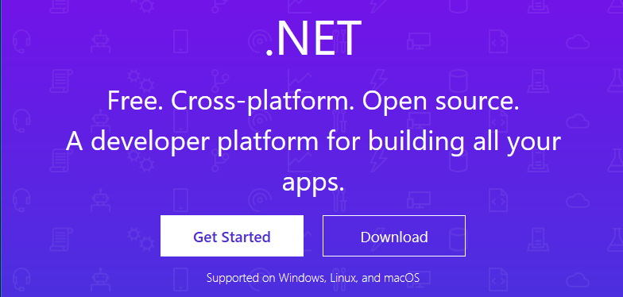

+++
title="F# and Fable Installfest 2019"
date=2019-02-01
draft=false
+++

Starting from scratch lets set up a development environment for F#.  Following this will get you completely set up for command line tools, servers and web UI development.  I will not be covering desktop or mobile development but you should know that F# also excels in those domains.

I will go thorugh setting up Visual Studio Code because that's what I use.  You could also use [Visual Studio](https://visualstudio.microsoft.com/) or [Jetbrains Rider](https://www.jetbrains.com/rider/).  

<!-- more -->

# MacOS?
If you're on MacOS {{icon(name="fas fa-apple-alt")}} (or Linux {{icon(name="fab fa-linux")}}) the steps will be very similar. I will try to point out where you need to do something different if you're not using Windows but there may be errors since I don't have a mac to test it on.  If you follow the instructions on a mac and they don't work please email or tweet me and let me know.

# Install F# with .net core

### Step 1 - Install .NET Core SDK
The first thing you need to do is install the .NET Core SDK.  This gives you a set of command line tools for creating projects managing depdendencies and building.

Go to [http://dot.net](http://dot.net) and click download then choose "Download .NET Core SDK".  It should automatically select the right version for the OS you're running.  When you install it should automatically add the `dotnet` command to your path.  

If you already have a version of .NET Core installed this will update to the latest and add it to your path.  It will leave the old version available in case something still needs it.

If you're feeling impatient you can go ahead and start on step 2 while the download finishes.

### Step 2 - Install Visual Studio Code and Ionide

* Install Visual Studio Code from [http://code.visualstudio.com](https://code.visualstudio.com/)
* Install ionide  *and C#*
* Install "visual studio build tools" -> f# compiler

# Mac
   * cd ~/Downloads
     curl -O https://download.mono-project.com/archive/5.18.0/macos-10-universal/MonoFramework-MDK-5.18.0.240.macos10.xamarin.universal.pkg
     sudo installer -pkg ~/Downloads/MonoFramework-MDK-5.18.0.240.macos10.xamarin.universal.pkg -target /
     cd -
   * https://www.mono-project.com/download/stable/#download-mac

## Build a new project (with tests)
* dotnet new console -lang f#
* dotnet build
* dotnet run
* dotnet new mstest -lang f#
* dotnet test
* dotnet watch *

==

# Fable

* Install node
    - https://nodejs.org/en/
    - scoop install nodejs
    - choco install nodejs
* Install yarn (Lets just prefer yarn)
    - scoop / choco
    - https://yarnpkg.com/en/docs/install#windows-stable
* Install fake 5
    - dotnet tool install -g fake-cli
    - (to update: dotnet tool update -g fake-cli)
* Templates
    - dotnet new -i safe.template
    - dotnet new safe -h
* 