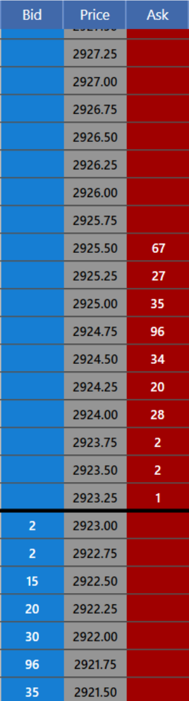

+++
title="Efficient Load Shedding for Options Market Data"
date=2020-03-20
[taxonomies]
tags=[".NET", "F#"]
+++

Handling financial data from an exchange is a fascinating problem.  The data from a single exchange can include tens of thousands of updates every second, typically in the form of UDP multicast.  Access to the real-time feed can cost thousands of dollars, but data becomes near worthless seconds (or fractions of a second) after transmission.

<!-- more -->

# Conventional Wisdom

The conventional wisdom around processing market data mostly involves very fast single producer queues.  In particular, the [LMAX Disruptor](https://lmax-exchange.github.io/disruptor/) has garnered some attention in the last few years for how they use large fixed-size buffers to make extremely fast queues for moving market data across threads.  At [Blue Trading Systems](https://www.bluetradingsystems.com/), I introduced an alternative solution that has served our needs very well over the last few years.


# Background

First, some background on what a market data feed looks like. If you're already familiar with how this works, you can [skip ahead](#requirements).

Each tradeable product (known as a security or instrument) at an exchange has a symbol in the same way that a stock does (MSFT, AAPL, etc.). Unlike a stock, each future or option has an [expiration (or maturation) date](https://www.investopedia.com/terms/m/maturitydate.asp) associated with it, which is when the future or option can be traded for its underlying product.  Options also include a [strike price](https://www.investopedia.com/terms/s/strikeprice.asp) and a buy or sell indicator.

Each product has a separate set of bids and offers that traders have submitted to the exchange.  The set of bids and offers for a particular security is called the [order book](https://www.investopedia.com/terms/o/order-book.asp).  Typically, the bids and offers at a particular price are summed to produce a total size available to trade at each price and visualized as a trading "ladder" with a central column of prices and the quantity available to trade on the left or right side depending on whether it is an offer to buy (bid) or sell (ask).  Any time there is a bid and an offer at the same price, the exchange matching engine matches the orders, and a trade occurs.



At the start of the day or when the software boots up, it subscribes to a cycling feed which contains the latest "snapshot" of the books as of a specific moment in time. The software also joins an incremental feed, which is publishing the changes to the books in real-time as orders arrive and matches occur.  The software will buffer the incremental updates until there is an overlap between the snapshot and the buffered feed and then it can begin applying the incremental updates to the snapshot and maintain the current state of the book for each product using only the incremental feed.

Futures and options use the same format for data distribution from the exchange. However, because an option includes both a date and a [price](https://www.investopedia.com/terms/s/strikeprice.asp) there many more option securities for each symbol. There also tend to be fewer outstanding orders on each security, so the books tend to be shallower (fewer rows on the ladder). Because of these differences in the shape of the data options are typically visualized differently in trading software.

<image src="sheets.png" width="584" />

Here is an example of a single option with [calls](https://www.investopedia.com/terms/c/calloption.asp) and [puts](https://www.investopedia.com/terms/p/put.asp) straddling a dark blue column with the [strike price](https://www.investopedia.com/terms/s/strikeprice.asp).  Each row shows only the best bid and offer for a single security.

The row with the gray highlight is the ["at the money"](https://www.investopedia.com/terms/a/atthemoney.asp) strike.  Generally, activity is higher closer to this strike and falls off as you move further away.

# Requirements

At BTS, there are two classes of market data consumers. Machines and humans. While each class of consumer has very different latency needs, they do share one very important similarity.  They **never** want to see stale data. 

# The Problem

This brings us to the fundamental problem, as I see it, with any queued system.  Most market data consumers only want to see a subset of the data.  

Your super-fast trading engine only needs to watch for price changes on securities that you have open orders on.  No matter how fast you can dequeue updates looking for the one you want, you're still burning cycles throwing away thousands of unrelated updates looking for the one that matters. 

Monitors only refresh at about 60Hz, so there's absolutely **no point** in delivering hundreds of updates per second that you'll literally never see.  I've seen multiple trading systems over the years that try to push every update down to the UI.  The developers spend a lot of time tuning for performance only to have the application fall over when the market heats up and they see a sudden increase in updates.  

Another common failure mode is a network glitch.  If you're trying to process all of the updates as they come in but your WiFi drops, you get a flood of updates to process when it reconnects.  The UI can fall behind the market for seconds or tens of seconds while displaying out of date information.


# The Solution

My solution to this problem is to avoid queues whenever possible.  Instead, I allocate a structure with a fixed memory location for each security as it is discovered in the feed.  Once assigned, the address of this block never changes, so references can be passed around safely and read directly. 

A trading engine only needs to check the securities that it is watching and can efficiently add new securities to watch by adding another address to the watchlist.  A process (like the UI) that needs to scan all prices across a variety of securities can take advantage of prefetching to pipeline reads to multiple securities in sequence. As an added bonus, this layout can be allocated in a shared memory section, so multiple processes on the same machine can read the memory without needing costly serialization.

It sounds simple, but in practice, there are a few key details needed to make this sufficiently fast.  

## No Locks

In an early version of this system, I tried to use a read/write spinlock for each security. I thought that the fine-grained locking would avoid contention.  However, due to the sheer frequency that the locks were acquired on both read and write sides, this quickly became a bottleneck.

Using a lock also allows the reader to apply back pressure to the writer, which we *don't* want.  If the writer is unable to keep up with the market data broadcast, it may miss a packet which would trigger costly recovery procedures.  The writer should *always* be able to write regardless of the state of the reader.  Since there is always a snapshot of the latest state stored in the memory block, the reader is always able to observe the most recent state.


## Single Writer

The key to making this work comes from the strong [memory ordering guarantees](https://software.intel.com/en-us/download/intel-64-and-ia-32-architectures-sdm-volume-3a-system-programming-guide-part-1) provided on x86/x64 systems. 

* Writes by a single processor are observed in the same order by all processors
* Writes by a single processor are NOT ordered with respect to writes from other processors
* Memory ordering obeys causality (memory ordering obeys transitive visibility)
* Any two stores are seen in consistent order by processors other than those performing the stores

This means that as long as we:

* Use a consistent thread and processor 
* Make sure we write to aligned memory
* Ensure the *compiler* doesn't re-order our writes (thanks GCC!)

We can update the memory block without needing an explicit lock.  Instead, we can use what I call an "optimistic lock" which lets the reader determine if the memory was written during the read.  If it wasn't, great, carry on. If it was, we simply read again.  If writes are updating a single cache line (64 bytes), it will be _very_ rare to even observe an incomplete write.

### Single Processor

The requirement to use a single processor is not onerous. As a general rule, a trading system should already be binding a particular socket to a particular core to avoid thrashing the CPU caches.  Even without being explicit about this, the Linux scheduler will prefer to keep a fast running thread on the same socket.

This does mean that each block needs to be associated with a particular thread since there's no assurance that multiple threads cannot write at the same time, which would be disastrous.  However, each market data feed necessarily comes from a single socket (or 2 sockets for redundancy); this is also a benefit for performance.  Keeping the securities for a particular feed on the same thread happens naturally and pays dividends in hot L1 and L2 caches.

### Preventing Compiler Re-Orders

In C++ we can ensure that the compiler doesn't re-order our accesses using an std::atomic with   std::memory_order_acquire and std::memory_order_release.  On an x64 CPU a write with memory_order_release will compile down to a regular MOV instruction (on aligned data).  The same as a regular non-atomic assignment!

## Optimistic Locking

Now we know we can write 64 bites atomically and cheaply **and** we can ensure those writes will be observed in the same order that we wrote them.  This lets us build some consistency guarantees for the reader.

Now if we take this simplified struct
```cpp
struct __attribute__((aligned(64))) TopOfBook {
    int64_t updated;
    double bid_price;
    double ask_price;
    uint32_t bid_quantity, ask_quantity;
};
```
The writer can update the struct by first writing a BUSY sentinel value to the `updated` field.  Then write the price and quantity for the top of book then write a new higher value to `updated`.  We could use an incrementing counter for `updated`, but I find it's convenient to use the write the current monotonic clock value.

The reader can make a simple comparison.  If the `updated` value is higher than the previous, we know there's new data. You can see how checking a collection of securities for updates can be done very quickly this way.  

If there is an update, then we copy the entire struct to our stack _and_ check the `updated` field again at the end.  If updated matches, we performed the copy successfully, and nothing new has been written.  If they differ, we **don't** know if all of the bytes in our copy come from a single write, so we copy again.  If we see the BUSY value, then we know a write is in progress and we have the option to skip this value and get it the next time or busy spin and wait for the write to complete.  (If we choose to spin we still need a timeout just in case the writing process crashed we probably don't want to spin forever).

Here's what that copy might look like in a simplified form.  Here `src` is the shared memory location, so even though it is marked const, the writer is updating it.
```cpp
bool optimistic_copy(
    int64_t last_updated, 
    const TopOfBook& src, 
    TopOfBook* result) {
    if (src.updated > last_updated) {
        TopOfBook temp;
        do {
            temp = src;
        } while(temp.updated != src.updated || temp.updated == -1);
        if (result) *result = temp;
        return true;
    }
    return false;
}
```

## Optimizations

The obvious drawback to optimistic locking is that it only works efficiently if the data you need to copy is small.  The larger the data, the less likely you are to copy it before it gets updated, and you have to retry.  It's important to monitor the number of retries happening in production to detect regressions that would otherwise silently degrade performance.

To keep the data under the lock small I divide the memory for market data into "hot" and "cold" memory segments.  The hot segment contained information read multiple times a second.  This structure needs to be small, so we have a high likelihood of keeping it in CPU cache for the trading engines.  The cold segment has less latency-sensitive data and is generally not read under an optimistic lock. The details of the security, for example, are stored in the cold section and treated as immutable.

## User Interface

One really interesting aspect of this pattern is with regard to user interfaces.  Our ladder now runs at a **fixed** frame rate.  We decide how often the ladder refreshes, and we run and test at exactly that frequency.  The client queries the server at a fixed interval and always gets the most recent values. This makes the BTS UI far more resilient to high volume market data than most other professional trading interfaces.

# Pro / Con

Software performance is about tradeoffs.  As the saying goes, "the fastest code is no code" but if "no code" solves your problem then, well, I'm not sure how you got here.

## Pro
#### You _always_ get the latest value when you ask.
You never have to worry about being behind the market.

#### The consumer determines the rate of updates.
This provides a safety net for fast moving market data which might otherwise overload consumers

## Con
#### You cannot reliably record tick-by-tick data.
If you want to record market data for later analysis you either have to tolerate that some information will be lost or look 

#### You lose _some_ ability to correlate between different events.
If you need to know that security A updated before security B down to the nanosecond you may need a different solution.

#### Larger working set
If you don't need to keep a snapshot of the last value for every security you can save memory using a queue


# Conclusion


